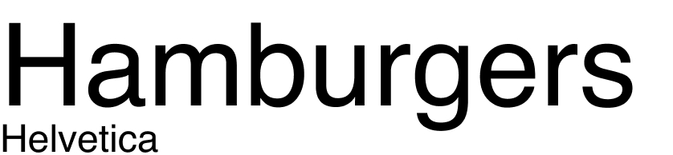
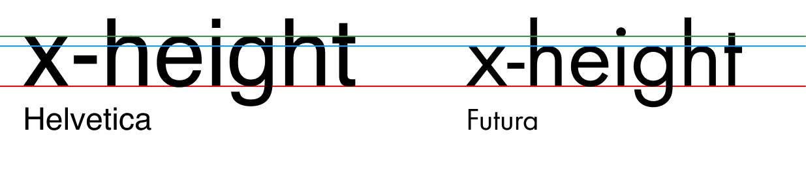
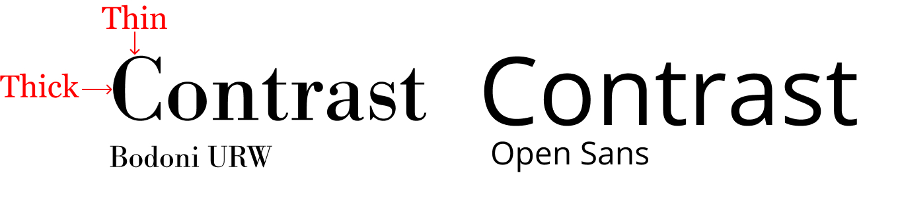
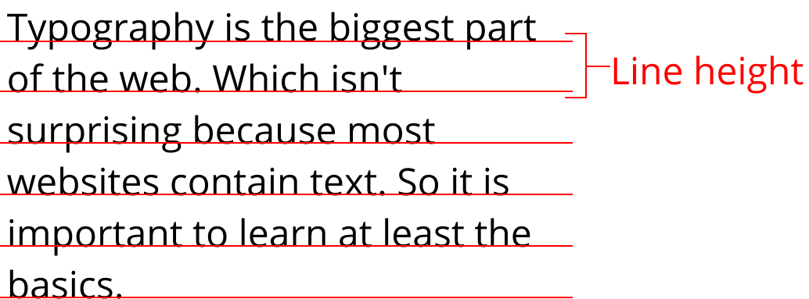

Typography is the biggest part of the web. Which isn't surprising because most websites contain text.

This article will focus on designing readable type on websites which includes consideration for accessibility. It will be split up into two parts. The first part will be about the rules behind readable type and the second part will be on actually implementing what we talk about here.

Consider this article the jumping off point to get you started with some basic typography terms and guidelines.

## Font groupings

Fonts are grouped depending on their characteristics. There are lots of different ones out there. You'll hear words like grotesk, geometric and humanist thrown around but I don't think you need to know them to yet (and just between you and me, I need to learn what they are too). As a start, you only need to know about two groupings: Serif and Sans-serif.

### Serif

Serif fonts have little ticks on the end of their letters, called 'serifs' (surprise). Influenced by the print era. These usually have a more formal look to them. Serif fonts include Times new roman, Georgia and Merriweather.

An example of Times New Roman, you've probably seen this before.

### Sans-serif

Sans-serif fonts are simply fonts without serifs. They're very popular on the web due a conception that they are easier to read on a screen than a serif font. Sans-serifs include Arial, Helvetica, Open Sans and Lato.

An example of Helvetica, a very famous sans-serif font

## Basic terminology

Here a few terms that'll you'll see and need to understand in context to this article.

### X-height

The x-height is the height of the 'x' character of the font. It is used an indicator to how tall the font is. You can see that despite being the same font size, Helvetica looks much bigger because the x-height is taller than Futura.

### Baseline

The baseline is the main line that our letters sit on. In the image above (on x-height), it is the red line.

### Contrast

Contrast is how different the strokes within your character are to one another. A font whose characters have a consistent stroke is considered low contrast. On the other end, a font with too much variation between the thinnest and heaviest stroke in considered high contrast. Notice the difference in strokes between Bodoni URW and Open Sans.

### Line height

Line height is the space in between lines of text. It is measured from baseline to baseline.

The space in between the red lines is spacing set by the line height.

## How to set typography for a nice reading experience

The best place to get started with typography is with content that will be read. There are a few rules that I follow when selecting a font for reading content. The rules are:

- High x-height
- Medium contrast
- Adjust your line height
- Limit the width of your text

### High x-height

A font with a higher x-height tend to easier to read than fonts that don't

### Low or Medium contrast fonts

Don't use fonts with too much contrast between the strokes

### Adjust the line height

No matter what font I use, I've always had to adjust the line height. The reason is that the rows of text can be a little tight by default, which can make it easy to lose your place when reading. The [W3C recommendation](https://www.w3.org/TR/WCAG21/#visual-presentation) is to set your line height to a value of 1.5 for accessibility.

### Limit the width of your text

The goal of readable type is to make it as easy as possible for your user to read your text. When setting the width of your text, you don't want it too wide because the user can get lost, but you don't want it too narrow otherwise the user has to do too much work jumping from one row to the next.

The recommendation is to set your width somewhere between 55-75 characters wide.

## Stick to a few fonts

There are thousands of fonts out there. To stop being overwhelmed, I recommend deciding on a fixed list of quality fonts and sticking with them for all of your designs until you get more confident. That's what I'm doing right now. To get started here are a few fonts that I like for reading copy. These are all free to use from [Google Fonts](https://fonts.google.com).

Sans-serif

- Open sans
- Roboto
- Helvetica

Serif

- Georgia
- Merriweather

With that being said, don't be afraid to try other fonts out. Eventually you'll build your own library to pull from.

## To learn more

Typography is a massive subject and it can't be covered in one blog post. But hopefully this post is enough for you to more informed choices when selecting a typeface. You should definitely keep learning about typography if you want to become a great web designer. Here are a few resources that I recommend to continue learning about typography:

- [Better web typography for a better web](https://betterwebtype.com/web-typography-book/) - If you only have time to read one book then make it this one. Matej does a great job explaining all you need to know to design great web typography.
- [On Web Typography](https://abookapart.com/products/on-web-typography) - Make this your second book you read on web typography
- [The Futur Typography course](https://thefutur.com/course/typography-01) - This is for people that want to dive deeper in to the foundations of Typography and not just the web side.

## Part 2 coming soon

A lot of theory in this one. I'm current working on part 2 of this series which will have more actionable steps and actual code snippets you will be able to use.
